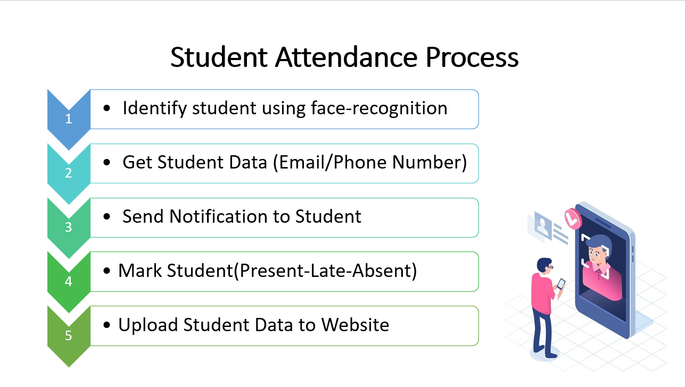
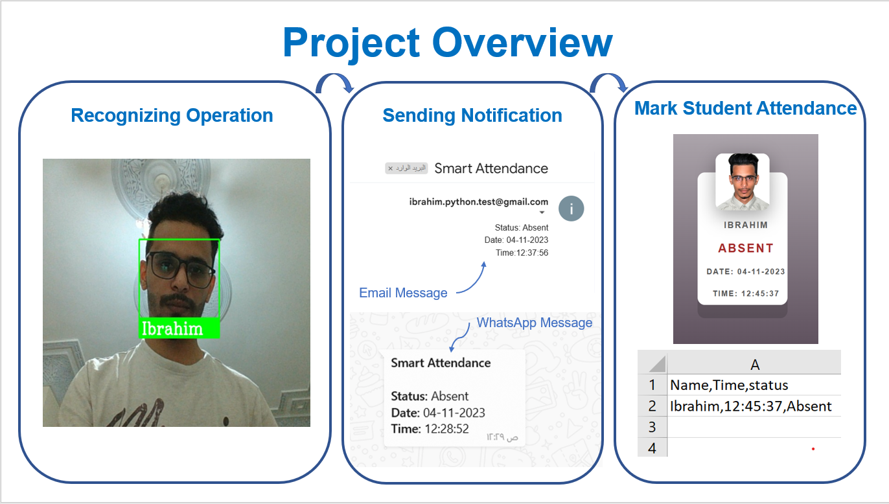
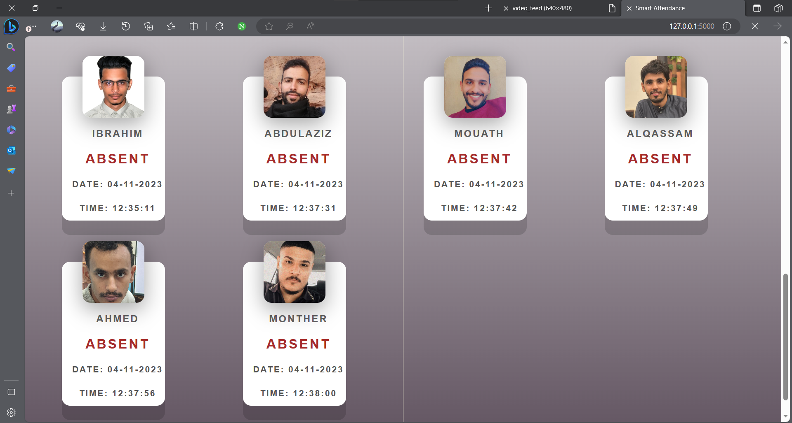

# Smart Attendance System

A face recognition-based attendance system built with Python, Flask, and OpenCV. This system automates attendance tracking by detecting and recognizing faces in real-time, marking attendance, and sending notifications via WhatsApp and email.

---

## Features
- **Real-time Face Detection**: Detects faces using the webcam.
- **Face Recognition**: Recognizes registered students and marks attendance.
- **Attendance Status**: Marks attendance as Present, Late, or Absent based on the time.
- **Notifications**: Sends attendance status via WhatsApp or email.
- **Web Interface**: Provides a user-friendly web interface to view attendance records.

---

## Demo

### 1. Home Page
 

The home page provides an overview of the system and allows users to start or stop the attendance process.

---

### 2. Attendance Process
 

The system follows these steps to mark attendance:
1. Identify the student using face recognition.
2. Retrieve the student's data (email or phone number).
3. Send a notification to the student.
4. Mark the student's attendance status (Present, Late, or Absent).
5. Upload the student's data to the website.

---

### 3. Project Overview


The system performs the following operations:
- **Recognizing Operation**: Detects and recognizes faces in real-time.
- **Sending Notification**: Sends notifications via WhatsApp or email.
- **Mark Student Attendance**: Marks attendance and updates the records.

---

### 4. Student Attendance Records
 

The attendance records are displayed on the website, showing the student's name, status, date, and time.

---

## Installation

### Prerequisites
- Python 3.8 or higher
- Git

### Steps
1. Clone the repository:
   ```bash
   git clone https://github.com/Ibrahim-devx/smart-attendance.git
   cd smart-attendance
2. Create a virtual environment:
   ```bash
    python -m venv venv
3. Activate the virtual environment:
   On Windows:
```bash
   venv\Scripts\activate
```
  On macOS/Linux:
   ```bash
      source venv/bin/activate
```

4. Install dependencies:
     ```bash
     pip install -r requirements.txt

5. Set up environment variables
```plaintext
EMAIL=your_email@gmail.com
EMAIL_PASSWORD=your_email_password
WHATSAPP_ID=your_whatsapp_id
WHATSAPP_API_TOKEN=your_whatsapp_api_token
ALLOWED_HOURS=8,10,12
REMOTE_SERVER=one.one.one.one
```
6.Run the application
```bash
python main.py
